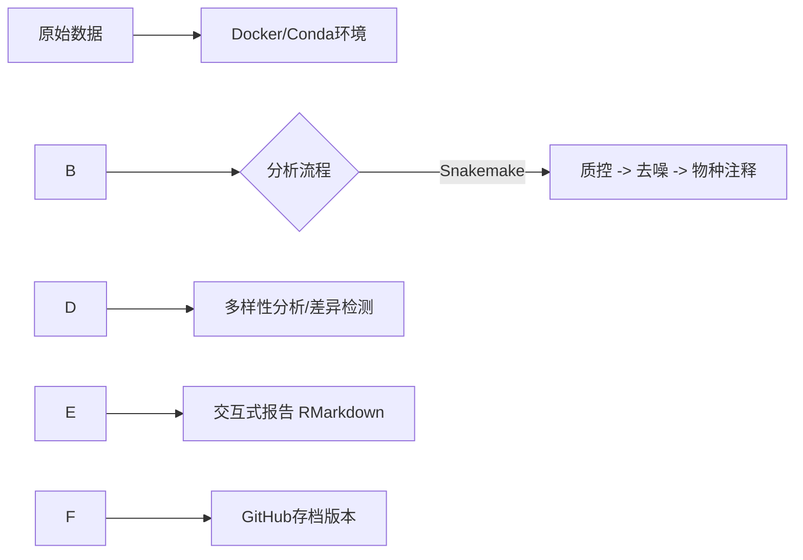

\# 2025303110122.md

\## 学号 2025303110122

\## 姓名 成一潇

\## 我的问题

\- 如何设计一个可重复的微生物组数据分析流程？

\## 模型的回答

1\. gpt-4o-mini

\- 设计一个可重复的微生物组数据分析流程需要遵循几个关键步骤，以确保数据的可追踪性、透明性和一致性。以下是一个大致的框架，可以帮助你构建这样一个流程：


\### 1. 定义研究问题和目标

&nbsp;  - 明确分析的目的，例如：比较不同样本组的微生物组成、探索特定微生物与健康状态之间的关联等。


\### 2. 样本收集和处理

&nbsp;  - \*\*选择样本\*\*：定义样本来源，包括样本类型（如粪便、皮肤、口腔等）和采集方法。

&nbsp;  - \*\*样本处理\*\*：记录样本的保存、运输和处理方式，以减少污染和变异。


\### 3. 数据获取

&nbsp;  - \*\*测序平台选择\*\*：选择合适的高通量测序技术（如16S rRNA测序、宏基因组测序等）。

&nbsp;  - \*\*数据质量控制\*\*：确保测序数据的质量，包括去除低质量序列和嵌合体的步骤。


\### 4. 生物信息学分析

&nbsp;  - \*\*数据预处理\*\*：

&nbsp;    - 使用工具如QINA、Trimmomatic等进行数据处理。

&nbsp;    - 去除引物、序列拼接、质量过滤等。

&nbsp;  - \*\*特征提取\*\*：

&nbsp;    - 使用工具（如QIIME2、DADA2）进行OTU（操作分类单元）或ASV（粗略序列变体）分析。

&nbsp;  - \*\*分类和注释\*\*：

&nbsp;    - 将序列与数据库（如Greengenes、SILVA等）进行比对以获得分类信息。


\### 5. 数据分析

&nbsp;  - \*\*统计分析\*\*：

&nbsp;    - 使用R（如phyloseq包）或Python进行数据分析，包括多样性分析（α多样性、β多样性等）和统计测试。

&nbsp;  - \*\*可视化\*\*：

&nbsp;    - 生成可视化图表（如条形图、PCA图、热图）以展示结果，使用ggplot2、matplotlib等工具。


\### 6. 结果解释和报告

&nbsp;  - \*\*结果汇总\*\*：总结发现，讨论与已有研究的关系，解释生物学意义。

&nbsp;  - \*\*编写报告\*\*：撰写详细的分析报告，包括方法、结果和讨论部分。


\### 7. 保存和共享数据

&nbsp;  - \*\*数据管理\*\*：将原始数据、处理结果和分析脚本存档在可访问的数据库或者数据仓库。

&nbsp;  - \*\*共享代码和脚本\*\*：使用GitHub等平台存放分析脚本，以便其他研究者可以重复分析过程。


\### 8. 重复性和透明性

&nbsp;  - \*\*登录分析步骤\*\*：在整个流程中，记录每一个步骤和参数设置，以便其他研究者可以完全复现你的分析。

&nbsp;  - \*\*预注册分析方案\*\*：考虑在研究开始前预注册分析方案，以提高结果的透明性和可信度。


\### 工具和平台推荐

\- \*\*数据处理\*\*：QIIME2、DADA2、Mothur

\- \*\*统计分析\*\*：R（phyloseq、vegan）、Python（pandas、scikit-bio）

\- \*\*可视化\*\*：ggplot2、matplotlib、plotly

\- \*\*版本控制\*\*：Git、GitHub


\### 总结

通过以上步骤构建一个系统的微生物组数据分析流程，不仅提高了研究的科学性和可信度，还为其他研究者提供了一个可重复的模型。这种透明的流程在微生物组研究中至关重要，以便于验证和扩展已有的研究结论。

2\. gemini-2.5-pro

\- 好的，这是一个非常重要且核心的问题。设计一个可重复的微生物组数据分析流程是现代计算生物学研究的基石。一个可重复的流程不仅能确保你自己的结果可以重现，也能让同行评审、合作者复现你的工作，大大增强了研究的透明度和可信度。


下面我将从\*\*核心理念、关键技术、流程步骤\*\*和\*\*实例\*\*四个方面，为你详细拆解如何设计一个可重复的微生物组数据分析流程。


---


\### 一、核心理念：让流程成为你方法的“活文档”


在开始之前，必须建立几个核心理念：


1\.  \*\*自动化优于手动操作\*\*：任何需要手动点击、复制粘贴或修改文件名的地方，都是不可重复的“黑洞”。目标是让整个流程从原始数据到最终图表，都可以通过一条或几条命令来执行。

2\.  \*\*代码即方法\*\*：你的分析脚本（Code）和配置文件（Configuration）本身就是你研究方法（Methods）最精确的描述。任何人拿到你的代码，就应该能理解并重现你的每一步分析。

3\.  \*\*环境隔离\*\*：你今天能运行的代码，明天可能因为某个软件库更新就报错了。必须锁定分析所依赖的所有软件及其版本，确保在任何时间、任何机器上都能创建出完全相同的计算环境。

4\.  \*\*代码与数据分离\*\*：分析逻辑（脚本）和具体参数（配置）应该分开。这样，当你想用同样的方法分析另一批数据时，只需修改配置文件，而无需触动核心代码。


---


\### 二、关键技术栈：构建可重复流程的“三驾马车”


要实现上述理念，你需要以下三类关键工具：


1\.  \*\*版本控制系统 (Version Control System) - Git\*\*

&nbsp;   \*   \*\*作用\*\*：追踪你的代码、脚本和配置文件的每一次修改。

&nbsp;   \*   \*\*为什么必须用？\*\*

&nbsp;       \*   \*\*记录历史\*\*：你可以随时回滚到任何一个历史版本，不怕改错代码。

&nbsp;       \*   \*\*协作\*\*：轻松与合作者共享代码，合并彼此的修改。

&nbsp;       \*   \*\*透明度\*\*：`git log`清晰地记录了谁、在何时、为什么做了修改。

&nbsp;   \*   \*\*实践\*\*：使用 GitHub, GitLab 等平台托管你的代码。\*\*注意：只追踪代码和小的配置文件，不要用Git追踪大的原始数据或中间文件。\*\*


2\.  \*\*环境管理工具 (Environment Management) - Conda / Docker\*\*

&nbsp;   \*   \*\*作用\*\*：创建独立、隔离的软件环境，精确控制每个软件的版​​本。

&nbsp;   \*   \*\*Conda\*\*:

&nbsp;       \*   \*\*优点\*\*：轻量级，易于上手。通过一个 `environment.yml` 文件，可以列出所有需要的软件包（如 `qiime2`, `fastqc`, `R-ggplot2`）及其版本。其他人拿到这个文件，就能用 `conda env create -f environment.yml` 命令一键创建一模一样的环境。

&nbsp;       \*   \*\*适用场景\*\*：个人项目、小型团队、快速原型开发。

&nbsp;   \*   \*\*Docker\*\*:

&nbsp;       \*   \*\*优点\*\*：完全隔离。它将整个操作系统环境（包括库文件、依赖项）打包成一个“容器”（Container）。这是目前最彻底、最可移植的环境隔离方案。

&nbsp;       \*   \*\*适用场景\*\*：需要跨平台（Linux, Mac, Windows）严格复现、发布给更广泛受众的复杂流程。


3\.  \*\*工作流管理系统 (Workflow Management System) - Snakemake / Nextflow\*\*

&nbsp;   \*   \*\*作用\*\*：将整个分析流程定义为一系列相互依赖的步骤（规则），并自动执行。

&nbsp;   \*   \*\*为什么比写一个大的`bash`脚本好？\*\*

&nbsp;       \*   \*\*自动化依赖管理\*\*：它知道`步骤B`的输入是`步骤A`的输出。当你运行流程时，它会自动判断哪些步骤需要执行。

&nbsp;       \*   \*\*并行计算\*\*：可以轻松地将任务分配到多核CPU或计算集群上，大大提高效率。

&nbsp;       \*   \*\*可扩展性\*\*：轻松添加、删除或修改某个分析步骤，而不会弄乱整个流程。

&nbsp;       \*   \*\*自带报告\*\*：能生成美观的HTML报告，展示每一步的运行情况和结果。


---


\### 三、标准微生物组分析流程（以16S为例）及可重复性设计


下面我们将一个典型的16S扩增子测序数据分析流程，拆解成可重复的模块。


\#### 步骤 0: 项目结构设计


一个良好、一致的目录结构是可重复性的起点。


```

my\_microbiome\_project/

├── .git/               # Git仓库

├── README.md           # 项目说明文档

├── config/

│   └── config.yaml     # 配置文件（样本信息、参数等）

├── data/

│   ├── raw/            # 原始测序数据 (fastq.gz)，不应被Git追踪

│   └── metadata.tsv    # 样本元数据

├── envs/

│   └── environment.yml # Conda环境定义文件

├── results/            # 所有分析结果的输出目录

│   ├── 01\_qc/

│   ├── 02\_denoising/

│   └── ...

├── scripts/

│   └── plot.R          # 用于绘图的R脚本

└── Snakefile           # Snakemake工作流定义文件

```


\#### 步骤 1: 原始数据质控 (QC)


\*   \*\*工具\*\*: FastQC, MultiQC

\*   \*\*可重复性设计\*\*:

&nbsp;   \*   在 `Snakefile` 中定义一个规则（rule），输入是 `data/raw/` 目录下的所有 `fastq.gz` 文件，输出是 `results/01\_qc/` 目录下的质控报告。

&nbsp;   \*   MultiQC 规则依赖于所有 FastQC 规则的完成。


\#### 步骤 2: 数据预处理（去噪/OTU聚类）


\*   \*\*工具\*\*: DADA2 (ASV), QIIME 2, VSEARCH (OTU)

\*   \*\*可重复性设计\*\*:

&nbsp;   \*   \*\*将参数外部化\*\*：DADA2的截断长度（truncLen）、过滤参数（maxEE）等，都应写在 `config.yaml` 文件里，而不是硬编码在脚本中。

&nbsp;   \*   `Snakefile` 中的 `dada2` 规则会读取 `config.yaml` 文件来获取这些参数。

&nbsp;   \*   输出结果（ASV表、代表序列）应有固定的命名规则，并存放在 `results/02\_denoising/` 目录下。


\#### 步骤 3: 物种注释


\*   \*\*工具\*\*: QIIME 2 的 `feature-classifier`, RDP Classifier

\*   \*\*可重复性设计\*\*:

&nbsp;   \*   \*\*数据库版本\*\*：在 `config.yaml` 中明确指定所用分类数据库（如 SILVA v138, GTDB r202）的路径和版本。最好提供下载链接或说明。

&nbsp;   \*   `Snakefile` 中的注释规则，其输入是上一步的代表序列，输出是物种注释表。


\#### 步骤 4: 多样性分析


\*   \*\*工具\*\*: QIIME 2, R (phyloseq, vegan)

\*   \*\*可重复性设计\*\*:

&nbsp;   \*   \*\*Alpha \& Beta 多样性\*\*: 抽样深度（sampling depth）是一个关键参数，必须在 `config.yaml` 中设定。

&nbsp;   \*   统计分析（如 PERMANOVA）和差异丰度分析（如 ANCOM-BC, DESeq2）的脚本应作为独立的 R 脚本（如 `scripts/differential\_abundance.R`）被 `Snakefile` 调用。

&nbsp;   \*   所有生成的图表和统计结果都保存在 `results/` 下的相应子目录中。


\#### 步骤 5: 文档和报告


\*   \*\*工具\*\*: R Markdown, Jupyter Notebook

\*   \*\*可重复性设计\*\*:

&nbsp;   \*   使用 R Markdown 或 Jupyter Notebook 撰写最终的分析报告。这些文档可以\*\*直接嵌入代码块\*\*来加载结果、生成图表和表格。

&nbsp;   \*   当数据或参数更新后，你只需重新“编织”（knit/render）这个文档，整个报告（包括所有图表和数值）都会自动更新。这是可重复报告的黄金标准。


---


\### 四、一个简化的实战工作流示例 (Snakemake + Conda)


让我们把上面的概念串起来。


1\.  \*\*定义Conda环境 (`envs/environment.yml`)\*\*

&nbsp;   ```yaml

&nbsp;   name: microbiome\_env

&nbsp;   channels:

&nbsp;     - bioconda

&nbsp;     - conda-forge

&nbsp;     - defaults

&nbsp;   dependencies:

&nbsp;     - snakemake-minimal

&nbsp;     - fastqc

&nbsp;     - multiqc

&nbsp;     - qiime2

&nbsp;   ```


2\.  \*\*定义配置文件 (`config/config.yaml`)\*\*

&nbsp;   ```yaml

&nbsp;   samples:

&nbsp;     - sampleA

&nbsp;     - sampleB

&nbsp;     - sampleC


&nbsp;   dada2\_params:

&nbsp;     trunc\_len\_f: 240

&nbsp;     trunc\_len\_r: 200

&nbsp;   ```


3\.  \*\*定义工作流 (`Snakefile`)\*\*

&nbsp;   ```python

&nbsp;   import yaml


&nbsp;   configfile: "config/config.yaml"


&nbsp;   SAMPLES = config\["samples"]


&nbsp;   rule all:

&nbsp;       input:

&nbsp;           "results/01\_qc/multiqc\_report.html",

&nbsp;           "results/02\_denoising/feature-table.qza"


&nbsp;   rule fastqc:

&nbsp;       input:

&nbsp;           "data/raw/{sample}\_R{read}.fastq.gz"

&nbsp;       output:

&nbsp;           "results/01\_qc/{sample}\_R{read}\_fastqc.html"

&nbsp;       params:

&nbsp;           outdir="results/01\_qc/"

&nbsp;       conda:

&nbsp;           "envs/environment.yml"

&nbsp;       shell:

&nbsp;           "fastqc -o {params.outdir} {input}"


&nbsp;   rule multiqc:

&nbsp;       input:

&nbsp;           expand("results/01\_qc/{sample}\_R{read}\_fastqc.html", sample=SAMPLES, read=\[1, 2])

&nbsp;       output:

&nbsp;           "results/01\_qc/multiqc\_report.html"

&nbsp;       conda:

&nbsp;           "envs/environment.yml"

&nbsp;       shell:

&nbsp;           "multiqc -o results/01\_qc/ -f {input}"


&nbsp;   rule dada2\_denoise:

&nbsp;       input:

&nbsp;           # 假设你有一个包含所有原始fastq路径的manifest文件

&nbsp;           manifest="data/manifest.tsv"

&nbsp;       output:

&nbsp;           table="results/02\_denoising/feature-table.qza",

&nbsp;           rep\_seqs="results/02\_denoising/rep-seqs.qza"

&nbsp;       params:

&nbsp;           trunc\_f=config\["dada2\_params"]\["trunc\_len\_f"],

&nbsp;           trunc\_r=config\["dada2\_params"]\["trunc\_len\_r"]

&nbsp;       conda:

&nbsp;           "envs/environment.yml"

&nbsp;       shell:

&nbsp;           """

&nbsp;           qiime dada2 denoise-paired \\

&nbsp;               --i-demultiplexed-seqs {input.manifest} \\

&nbsp;               --p-trunc-len-f {params.trunc\_f} \\

&nbsp;               --p-trunc-len-r {params.trunc\_r} \\

&nbsp;               --o-table {output.table} \\

&nbsp;               --o-representative-sequences {output.rep\_seqs}

&nbsp;           """

&nbsp;   ```


4\.  \*\*运行流程\*\*


&nbsp;   首先，创建环境：`conda env create -f envs/environment.yml`

&nbsp;   然后，激活环境并运行：

&nbsp;   ```bash

&nbsp;   conda activate microbiome\_env

&nbsp;   # -c1 表示用1个核心，--use-conda会自动处理软件环境

&nbsp;   snakemake -c1 --use-conda

&nbsp;   ```


\### 总结


设计一个可重复的微生物组分析流程，本质上是一次从“手工作坊”到“工业化生产”的思维转变。


\*\*黄金法则\*\*：


\*   \*\*一切皆代码\*\*：使用 `Git` 管理所有脚本和配置。

\*   \*\*环境可复现\*\*：使用 `Conda` 或 `Docker` 锁定软件环境。

\*   \*\*流程自动化\*\*：使用 `Snakemake` 或 `Nextflow` 编排分析步骤。

\*   \*\*参数配置化\*\*：将易变的参数（如文件路径、阈值）写入独立的配置文件。

\*   \*\*文档清晰化\*\*：在 `README.md` 中写清楚如何设置和运行整个流程。


一开始可能会觉得繁琐，但一旦建立起这个框架，你的科研效率、结果的可靠性和与他人协作的顺畅度都将得到质的飞跃。

3\. kimi-k2.5

\-  设计一个可重复的微生物组数据分析流程（Reproducible Microbiome Analysis Pipeline）需要从\*\*计算环境、工作流管理、版本控制、文档规范\*\*四个维度进行系统规划。以下是一个基于现代生物信息学最佳实践的完整设计方案：


---


\## 一、核心设计原则


\### 1. \*\*可重复性层级\*\*

\- \*\*Level 1\*\*: 代码可重复（相同输入→相同代码→相同输出）

\- \*\*Level 2\*\*: 环境可重复（依赖版本锁定）

\- \*\*Level 3\*\*: 计算可移植（跨平台/跨服务器运行）


\### 2. \*\*关键要素\*\*

\- \*\*确定性\*\*：固定随机种子（`random.seed`, `numpy.random.seed`, `set.seed` in R）

\- \*\*原子性\*\*：每个步骤可独立运行和验证

\- \*\*幂等性\*\*：多次运行产生相同结果


---


\## 二、技术架构设计


\### \*\*推荐技术栈组合\*\*

```bash

版本控制: Git + GitHub/GitLab

工作流引擎: Snakemake (推荐) 或 Nextflow

环境管理: Conda (Bioconda通道) + Docker/Singularity

配置管理: YAML/JSON 配置文件

报告生成: R Markdown / Jupyter Book / MultiQC

```


\### \*\*目录结构规范\*\*

```

microbiome-pipeline/

├── workflow/               # Snakemake/Nextflow 流程文件

│   ├── rules/             # 模块化规则（质控、比对、统计）

│   ├── envs/              # Conda环境定义文件

│   └── scripts/           # 辅助R/Python脚本

├── config/                # 参数配置文件（与代码分离）

│   ├── config.yaml        # 主配置

│   └── samples.tsv        # 样本元数据

├── data/                  # 数据目录（Git忽略）

│   ├── raw/               # 原始测序数据（只读）

│   └── processed/         # 中间文件

├── results/               # 分析结果（版本控制）

├── resources/             # 参考数据库（路径配置）

├── tests/                 # 单元测试（小数据集）

├── Dockerfile             # 容器定义

└── README.md              # 完整文档

```


---


\## 三、分步骤实现方案


\### \*\*阶段1：原始数据预处理（确定性质控）\*\*


```yaml

\# config/config.yaml

samplesheet: "config/samples.tsv"

params:

&nbsp; fastp:

&nbsp;   qualified\_quality\_phred: 20

&nbsp;   cut\_front: true

&nbsp;   cut\_tail: true

&nbsp; kraken2:

&nbsp;   db\_path: "resources/kraken2/minikraken2\_v2\_8GB\_201904\_UPDATE"

&nbsp;   confidence: 0.05

&nbsp; random\_seed: 42  # 关键：固定所有随机过程

```


\*\*关键实践\*\*：

\- 使用 `fastp` 而非 `Trimmomatic`（更快的确定性修剪）

\- 记录软件版本到 `versions.yaml`：

&nbsp; ```python

&nbsp; # 在Snakemake规则中

&nbsp; shell: "{params.cmd} --version > {log.version} 2>\&1"

&nbsp; ```


\### \*\*阶段2：容器化环境（环境可重复）\*\*


```dockerfile

\# Dockerfile

FROM condaforge/mambaforge:latest

LABEL version="1.0.0"


COPY workflow/envs/environment.yml /tmp/

RUN mamba env create -f /tmp/environment.yml -n microbiome

ENV PATH /opt/conda/envs/microbiome/bin:$PATH


\# 锁定特定版本

RUN conda list --explicit > /opt/conda/envs/microbiome/conda-lock.txt

```


\*\*Singularity（HPC环境）\*\*：

```bash

singularity pull docker://yourrepo/microbiome-pipeline:v1.0.0

```


\### \*\*阶段3：工作流编排（Snakemake示例）\*\*


```python

\# workflow/Snakefile

configfile: "config/config.yaml"


\# 确定性设置

import random

random.seed(config\["params"]\["random\_seed"])


rule all:

&nbsp;   input:

&nbsp;       "results/multiqc\_report.html",

&nbsp;       "results/phyloseq\_object.RDS",

&nbsp;       "results/beta\_diversity\_pcoa.pdf"


\# 模块化规则

include: "rules/qc.smk"

include: "rules/taxonomy.smk"

include: "rules/diversity.smk"

```


```python

\# workflow/rules/taxonomy.smk

rule kraken2:

&nbsp;   input:

&nbsp;       r1 = "results/trimmed/{sample}\_R1.fastq.gz",

&nbsp;       r2 = "results/trimmed/{sample}\_R2.fastq.gz"

&nbsp;   output:

&nbsp;       report = "results/kraken2/{sample}.kreport2",

&nbsp;       classified = "results/kraken2/{sample}.classified.fastq"

&nbsp;   params:

&nbsp;       db = config\["params"]\["kraken2"]\["db\_path"],

&nbsp;       confidence = config\["params"]\["kraken2"]\["confidence"]

&nbsp;   conda:

&nbsp;       "../envs/taxonomy.yaml"  # 版本锁定

&nbsp;   log:

&nbsp;       "logs/kraken2/{sample}.log"

&nbsp;   shell:

&nbsp;       """

&nbsp;       kraken2 --db {params.db} \\

&nbsp;               --confidence {params.confidence} \\

&nbsp;               --paired {input.r1} {input.r2} \\

&nbsp;               --report {output.report} \\

&nbsp;               --classified-out {output.classified} \\

&nbsp;               > {log} 2>\&1

&nbsp;       """

```


\### \*\*阶段4：统计分析与可视化（R端可重复）\*\*


```r

\# workflow/scripts/alpha\_diversity.R

\#!/usr/bin/env Rscript

library(phyloseq)

library(ggplot2)


\# 接收Snakemake参数

args <- commandArgs(trailingOnly = TRUE)

input\_phyloseq <- args\[1]

output\_plot <- args\[2]

seed <- as.numeric(args\[3])


\# 确定性设置

set.seed(seed)


\# 分析代码...

p <- plot\_richness(physeq, measures=c("Observed", "Shannon", "Simpson"))

ggsave(output\_plot, p, width=10, height=6)


\# 保存会话信息（关键！）

writeLines(capture.output(sessionInfo()), 

&nbsp;          gsub(".pdf", "\_sessionInfo.txt", output\_plot))

```


---


\## 四、质量保障机制


\### \*\*1. 自动化测试\*\*

```python

\# tests/test\_pipeline.py (使用pytest)

import subprocess


def test\_dry\_run():

&nbsp;   """测试流程语法"""

&nbsp;   result = subprocess.run(

&nbsp;       \["snakemake", "-n", "--configfile", "tests/test\_config.yaml"],

&nbsp;       capture\_output=True

&nbsp;   )

&nbsp;   assert result.returncode == 0


def test\_small\_dataset():

&nbsp;   """使用tiny数据集验证输出一致性"""

&nbsp;   # 运行流程

&nbsp;   # MD5校验关键输出文件

```


\### \*\*2. 数据库版本控制\*\*

\- 使用 `git-lfs` 管理小型参考数据库

\- 大型数据库记录MD5校验和与下载日期：

&nbsp; ```yaml

&nbsp; resources:

&nbsp;   kraken2\_db:

&nbsp;     url: "ftp://ftp.ccb.jhu.edu/pub/data/kraken2\_dbs/minikraken2\_v2\_8GB\_201904\_UPDATE.tgz"

&nbsp;     md5: "a184ae5... "

&nbsp;     downloaded: "2024-01-15"

&nbsp; ```


\### \*\*3. 完整审计追踪\*\*

集成 `git-tracker` 或 `recordr` 自动记录：

\- 代码版本（Git commit hash）

\- 软件版本（Conda explicit list）

\- 运行时间/参数/硬件信息


---


\## 五、发布与共享


\### \*\*1. 符合FAIR原则的发布\*\*

\- \*\*GitHub Release\*\*: 打标签（`v1.0.0`）并附DOI（Zenodo集成）

\- \*\*Dockstore\*\*: 注册Docker镜像

\- \*\*WorkflowHub\*\*: 注册工作流


\### \*\*2. 配套文档（README模板）\*\*

```markdown

\## 可重复性声明

\- \*\*代码版本\*\*: `git checkout v1.2.0`

\- \*\*容器镜像\*\*: `docker pull user/pipeline:v1.2.0`

\- \*\*参考数据库\*\*: 见 `config/databases.md5`

\- \*\*随机种子\*\*: 42（见 `config/config.yaml`）


\### 一键复现

```bash

\# 1. 克隆特定版本

git clone --branch v1.2.0 https://github.com/user/pipeline.git


\# 2. 使用预构建容器

snakemake --use-singularity --configfile config/publication\_config.yaml


\# 3. 验证结果

md5sum -c results/expected\_checksums.md5

```

```


---


\## 六、常见问题与解决方案


| 问题 | 解决方案 |

|------|---------|

| \*\*随机性差异\*\* | 固定`numpy`, `random`, `set.seed`；使用`--deterministic`标志（Bracken等工具） |

| \*\*线程差异\*\* | 某些算法（如UCLUST）的多线程结果不一致，单线程运行关键步骤或设置`--threads 1` |

| \*\*浮点精度\*\* | 跨CPU架构（Intel vs AMD）差异，使用容器固定BLAS库（OpenBLAS/MKL） |

| \*\*数据库更新\*\* | 本地缓存数据库，禁止自动更新（如KMA的`-u`选项） |


---


\## 七、进阶建议


1\. \*\*参数扫描\*\*：使用Snakemake的`--config`进行敏感性分析（如不同rarefaction深度）

2\. \*\* cloud-ready\*\*: 配置AWS Batch或Google Life Sciences执行环境

3\. \*\*PROV格式\*\*：使用W3C PROV标准记录数据血缘关系

4\. \*\*nbdev\*\*：将Jupyter Notebook转为可测试的模块化代码


\*\*最小可重复示例\*\*：建议从 \[Snakemake官方微生物组教程](https://snakemake.readthedocs.io/en/stable/tutorial/basics.html) 开始，逐步添加上述可重复性层。


通过这种设计，你的分析流程应能通过 \*\*"Three Years Later Test"\*\*（三年后在新服务器上仍能产生相同结果）和 \*\*"Reviewer Test"\*\*（审稿人能一键复现图表）。

4\. deepseek-r1

\- 

设计可重复的微生物组数据分析流程需围绕 \*\*版本控制、自动化、环境隔离、模块化和文档化\*\* 五大核心原则。以下是一个系统化的设计方案：


---


\### \*\*1. 环境管理：消除依赖冲突\*\*

\- \*\*容器化\*\*：使用 \*\*Docker\*\* 或 \*\*Singularity\*\* 封装所有工具（如 QIIME2, DADA2, PICRUSt2）和依赖库，固定版本。

&nbsp; ```dockerfile

&nbsp; # 示例：DADA2流程的Docker基础镜像

&nbsp; FROM qiime2/core:2023.9

&nbsp; RUN apt-get update \&\& apt-get install -y r-base=4.3.0

&nbsp; RUN Rscript -e "install.packages('dada2', version='1.28.0')"

&nbsp; ```

\- \*\*包管理\*\*：用 \*\*Conda\*\* 定义精确环境 (`environment.yml`)。


---


\### \*\*2. 脚本自动化：避免手动操作\*\*

\- \*\*Workflow工具\*\*：

&nbsp; - \*\*Snakemake\*\* (推荐)：基于 Python 的声明式语法，可视化流程拓扑图。

&nbsp;   ```python

&nbsp;   rule demultiplex:

&nbsp;       input: "raw\_data.fastq"

&nbsp;       output: "demux/{sample}.fastq"

&nbsp;       shell: "qiime demux emp-paired --i-seqs {input} --output-dir demux/"

&nbsp;   ```

&nbsp; - Nextflow 或 CWL：支持跨平台和云环境。

\- \*\*自动化报告\*\*：嵌入 RMarkdown/Jupyter Notebook，动态生成分析报告。


---


\### \*\*3. 版本控制：全程追踪变更\*\*

\- \*\*数据和代码\*\*：

&nbsp; - `Git` 管理代码

&nbsp; - `DVC` (Data Version Control) 或 `git-lfs` 管理原始数据和处理文件

\- \*\*数据库版本锁定\*\*：

&nbsp; - 明确记录如 `Greengenes 13\_8` / `SILVA 138` / `UNITE 8.3` 等参考数据库版本


---


\### \*\*4. 模块化设计：灵活替换工具\*\*

分层设计，各阶段独立封装：

1\. \*\*原始数据处理\*\*：质控 (`FastQC/Trimmomatic`)，去宿主序列 (`Bowtie2`)

2\. \*\*特征分析\*\*：

&nbsp;  - 扩增子：`DADA2` (去噪) / `Deblur` (ASV) / `VSEARCH` (OTU)

&nbsp;  - 宏基因组：`MetaPhlAn` / `HUMAnN3`

3\. \*\*下游分析\*\*：

&nbsp;  - 多样性：`alpha/beta-diversity` (QIIME2)

&nbsp;  - 差异分析：`ANCOM-BC`, `MaAsLin2`, `LEfSe`

&nbsp;  - 功能预测：`PICRUSt2`, `Tax4Fun2`


---


\### \*\*5. 元数据标准化\*\*

\- 强制要求\*\*样本元数据\*\*符合 \*\*MIxS 标准\*\*（\[微生物组数据标准](https://gensc.org/mixs/)）

\- 通过 `TSV` 文件存储并校验完整性：

&nbsp; ```bash

&nbsp; # 元数据校验脚本示例

&nbsp; qiime tools validate --type 'SampleData\[PairedEndSequencesWithQuality]' metadata.tsv

&nbsp; ```


---


\### \*\*6. 结果可再现性\*\*

\- \*\*随机种子固定\*\*：在脚本开头设置全局随机种子（如 `set.seed(123)`）

\- \*\*流水线快照\*\*：用 `renv` (R) 或 `pip freeze` (Python) 记录软件状态


---


\### \*\*7. 文档和测试\*\*

\- \*\*README.md\*\*：清晰记录安装、运行、参数调整步骤

\- \*\*单元测试\*\*：对关键模块（如物种注释、Alpha多样性计算）进行验证

&nbsp; ```python

&nbsp; # 示例：使用pytest测试多样性计算

&nbsp; def test\_shannon\_diversity():

&nbsp;     counts = \[10, 5, 5]

&nbsp;     assert round(calculate\_shannon(counts), 2) == 1.05

&nbsp; ```


---


\### \*\*推荐技术栈整合\*\*




---


\### \*\*验证和优化\*\*

\- 使用模拟数据集（如 \[CAMISIM](https://github.com/CAMI-challenge/CAMISIM)）测试流程准确性

\- 性能监控：记录各步骤CPU/内存使用（`snakemake --profile` 或自定义日志）


> \*\*避坑提示\*\*：避免绝对路径！用配置文件（`config.yaml`）定义路径变量。每次分析生成独立的 `sessionInfo.txt` 保存环境状态。


---


通过以上设计，团队内任何成员只需执行 `git clone \&\& snakemake --use-conda` 即可完整复现分析结果，满足同行评审对可重复性的严苛要求。

5\. claude-sonnet-4-5

\- # 可重复的微生物组数据分析流程设计


\## 1. 核心原则


\### 1.1 可重复性三要素

\- \*\*代码化\*\*: 所有分析步骤用脚本实现

\- \*\*版本控制\*\*: 跟踪代码和数据变化

\- \*\*环境隔离\*\*: 确保依赖项一致性


\## 2. 流程架构


```

微生物组分析流程

├── 原始数据管理

├── 预处理与质控

├── 特征提取

├── 统计分析

├── 可视化

└── 报告生成

```


\## 3. 实施方案


\### 3.1 项目结构


```bash

microbiome-project/

├── data/

│   ├── raw/              # 原始测序数据

│   ├── metadata/         # 样本元数据

│   └── processed/        # 处理后数据

├── scripts/

│   ├── 01\_quality\_control.sh

│   ├── 02\_taxonomy\_assignment.R

│   ├── 03\_diversity\_analysis.R

│   └── 04\_differential\_abundance.R

├── results/

│   ├── figures/

│   └── tables/

├── envs/

│   ├── environment.yml   # Conda环境

│   └── requirements.txt  # Python依赖

├── config/

│   └── params.yaml       # 参数配置

├── workflow/

│   └── Snakefile         # 工作流定义

└── README.md

```


\### 3.2 环境管理（使用Conda）


\*\*environment.yml\*\*:

```yaml

name: microbiome-analysis

channels:

&nbsp; - conda-forge

&nbsp; - bioconda

&nbsp; - defaults

dependencies:

&nbsp; - python=3.9

&nbsp; - r-base=4.2

&nbsp; - qiime2=2023.5

&nbsp; - fastp

&nbsp; - bioconductor-phyloseq

&nbsp; - bioconductor-deseq2

&nbsp; - r-vegan

&nbsp; - r-ggplot2

&nbsp; - snakemake

&nbsp; - jupyter

```


\### 3.3 工作流管理（使用Snakemake）


\*\*Snakefile\*\*:

```python

configfile: "config/params.yaml"


\# 定义样本

SAMPLES = config\["samples"]


rule all:

&nbsp;   input:

&nbsp;       "results/quality\_report.html",

&nbsp;       "results/taxonomy\_table.tsv",

&nbsp;       "results/alpha\_diversity.pdf",

&nbsp;       "results/beta\_diversity.pdf"


rule quality\_control:

&nbsp;   input:

&nbsp;       r1="data/raw/{sample}\_R1.fastq.gz",

&nbsp;       r2="data/raw/{sample}\_R2.fastq.gz"

&nbsp;   output:

&nbsp;       r1="data/processed/{sample}\_R1\_trimmed.fastq.gz",

&nbsp;       r2="data/processed/{sample}\_R2\_trimmed.fastq.gz",

&nbsp;       report="results/qc/{sample}\_fastp.html"

&nbsp;   threads: 4

&nbsp;   shell:

&nbsp;       """

&nbsp;       fastp -i {input.r1} -I {input.r2} \\

&nbsp;             -o {output.r1} -O {output.r2} \\

&nbsp;             -h {output.report} \\

&nbsp;             -w {threads}

&nbsp;       """


rule taxonomy\_assignment:

&nbsp;   input:

&nbsp;       expand("data/processed/{sample}\_R1\_trimmed.fastq.gz", 

&nbsp;              sample=SAMPLES)

&nbsp;   output:

&nbsp;       "results/taxonomy\_table.tsv"

&nbsp;   params:

&nbsp;       database=config\["database"]

&nbsp;   script:

&nbsp;       "scripts/02\_taxonomy\_assignment.R"

```


\### 3.4 参数配置


\*\*config/params.yaml\*\*:

```yaml

\# 样本信息

samples:

&nbsp; - sample1

&nbsp; - sample2

&nbsp; - sample3


\# 数据库路径

database: "/path/to/silva\_database"


\# 分析参数

quality\_control:

&nbsp; min\_length: 150

&nbsp; quality\_threshold: 20


diversity:

&nbsp; rarefaction\_depth: 10000

&nbsp; 

statistics:

&nbsp; alpha: 0.05

&nbsp; fdr\_method: "BH"

```


\### 3.5 核心分析脚本示例


\*\*scripts/03\_diversity\_analysis.R\*\*:

```r

\#!/usr/bin/env Rscript


\# 加载必要的包

suppressPackageStartupMessages({

&nbsp; library(phyloseq)

&nbsp; library(vegan)

&nbsp; library(ggplot2)

&nbsp; library(yaml)

})


\# 读取配置

config <- read\_yaml("config/params.yaml")


\# 设置随机种子确保可重复性

set.seed(42)


\# 读取数据

otu\_table <- read.table("results/otu\_table.tsv", 

&nbsp;                       header=TRUE, row.names=1)

taxonomy <- read.table("results/taxonomy\_table.tsv", 

&nbsp;                      header=TRUE, row.names=1)

metadata <- read.table("data/metadata/sample\_metadata.tsv", 

&nbsp;                      header=TRUE, row.names=1)


\# 创建phyloseq对象

ps <- phyloseq(

&nbsp; otu\_table(otu\_table, taxa\_are\_rows=TRUE),

&nbsp; tax\_table(as.matrix(taxonomy)),

&nbsp; sample\_data(metadata)

)


\# Alpha多样性分析

alpha\_div <- estimate\_richness(ps, measures=c("Shannon", "Simpson"))


\# 可视化

p <- plot\_richness(ps, x="Group", measures=c("Shannon", "Simpson")) +

&nbsp; theme\_bw() +

&nbsp; labs(title="Alpha Diversity by Group")


ggsave("results/figures/alpha\_diversity.pdf", p, width=8, height=6)


\# Beta多样性分析

ps\_rare <- rarefy\_even\_depth(ps, sample.size=config$diversity$rarefaction\_depth)

ord <- ordinate(ps\_rare, method="PCoA", distance="bray")


p2 <- plot\_ordination(ps\_rare, ord, color="Group") +

&nbsp; theme\_bw() +

&nbsp; labs(title="Beta Diversity (Bray-Curtis)")


ggsave("results/figures/beta\_diversity.pdf", p2, width=8, height=6)


\# 保存结果

write.table(alpha\_div, "results/tables/alpha\_diversity.tsv", 

&nbsp;           sep="\\t", quote=FALSE)


\# 会话信息（用于重现）

writeLines(capture.output(sessionInfo()), 

&nbsp;          "results/session\_info.txt")

```


\## 4. 最佳实践


\### 4.1 版本控制


```bash

\# 初始化Git仓库

git init

git add .

git commit -m "Initial commit"


\# .gitignore示例

data/raw/\*

\*.fastq.gz

\*.bam

!data/raw/README.md

```


\### 4.2 Docker容器化


\*\*Dockerfile\*\*:

```dockerfile

FROM continuumio/miniconda3:latest


WORKDIR /analysis


\# 复制环境文件

COPY envs/environment.yml .


\# 创建conda环境

RUN conda env create -f environment.yml


\# 激活环境

SHELL \["conda", "run", "-n", "microbiome-analysis", "/bin/bash", "-c"]


COPY . .


CMD \["snakemake", "--cores", "8"]

```


\### 4.3 文档化


\*\*README.md\*\*:

```markdown

\# 微生物组分析流程


\## 快速开始


1\. 创建环境:

&nbsp;  ```bash

&nbsp;  conda env create -f envs/environment.yml

&nbsp;  conda activate microbiome-analysis

&nbsp;  ```


2\. 准备数据:

&nbsp;  - 将原始数据放入 `data/raw/`

&nbsp;  - 准备元数据文件 `data/metadata/sample\_metadata.tsv`


3\. 运行分析:

&nbsp;  ```bash

&nbsp;  snakemake --cores 8

&nbsp;  ```


\## 输出说明

\- `results/figures/`: 所有图表

\- `results/tables/`: 数据表格

\- `results/session\_info.txt`: R包版本信息

```


\### 4.4 数据验证


\*\*scripts/00\_validate\_data.py\*\*:

```python

import pandas as pd

import sys


def validate\_metadata(file\_path):

&nbsp;   """验证元数据格式"""

&nbsp;   try:

&nbsp;       df = pd.read\_csv(file\_path, sep='\\t', index\_col=0)

&nbsp;       

&nbsp;       # 检查必需列

&nbsp;       required\_cols = \['Group', 'Age', 'Sex']

&nbsp;       if not all(col in df.columns for col in required\_cols):

&nbsp;           raise ValueError(f"Missing required columns: {required\_cols}")

&nbsp;       

&nbsp;       # 检查缺失值

&nbsp;       if df.isnull().any().any():

&nbsp;           print("Warning: Missing values detected")

&nbsp;       

&nbsp;       print("✓ Metadata validation passed")

&nbsp;       return True

&nbsp;   

&nbsp;   except Exception as e:

&nbsp;       print(f"✗ Metadata validation failed: {e}")

&nbsp;       return False


if \_\_name\_\_ == "\_\_main\_\_":

&nbsp;   validate\_metadata("data/metadata/sample\_metadata.tsv")

```


\## 5. 运行与监控


```bash

\# 干运行（检查流程）

snakemake -n


\# 生成流程图

snakemake --dag | dot -Tpdf > workflow.pdf


\# 运行分析

snakemake --cores 8 --use-conda


\# 生成报告

snakemake --report report.html

```


\## 6. 关键要点


✅ \*\*使用工作流管理系统\*\* (Snakemake/Nextflow)  

✅ \*\*环境隔离\*\* (Conda/Docker)  

✅ \*\*参数外部化\*\* (YAML配置文件)  

✅ \*\*记录软件版本\*\* (sessionInfo)  

✅ \*\*代码审查与测试\*\*  

✅ \*\*完整文档\*\*  

✅ \*\*版本控制\*\* (Git)  


这样的流程设计可以确保分析的可重复性、可追溯性和可共享性！

\## 总结和分析

1\. gpt-4o-mini

2\. gemini-2.5-pro

3\. kimi-k2.5

4\. claude-sonnet-4-5

5\. deepseek-r1


