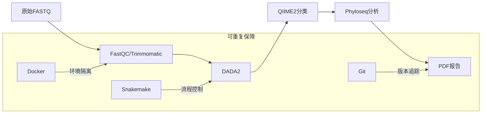

# 第二次课后作业


**学号：**<u>2025305120260</u>

**姓名：**<u>吴靖</u>

------

 

## 一、模型比较

### 1.1 问题描述

如何设计一个可重复的微生物组数据分析流程？

------

### 1.2 模型回答

#### **（1）gpt-4o**

设计一个可重复的微生物组数据分析流程需要考虑数据获取、预处理、分析以及结果解释等方面。以下是一个可能的框架：

**1. 数据获取**

- **样品采集**: 注意样品采集的标准化，确保采集过程一致，避免污染。
- **元数据记录**: 详细记录样品的背景信息，包括采集时间、环境条件、样品类型等。
- **数据存储**: 使用规范的命名和版本控制系统（如Git）管理数据文件。

**2. 数据预处理**

- **质量控制（QC）**:
  - 使用软件（如FastQC）检查测序数据的质量。
  - 去除低质量reads和接头序列（使用工具如Trimmomatic或Cutadapt）。

- **序列比对和过滤**:
  - 使用适合的工具（如USEARCH或DADA2）生成OTUs或ASVs。
  - 去除PCR扩增污染或非生物来源的序列。

**3. 数据分析**

- **多样性分析（Diversity Analysis）**:
  - 使用软件包（如QIIME 2, mothur）进行α多样性和β多样性分析。
  - 可视化分析结果（使用R包如Phyloseq, ggplot2）。

- **分类学分析（Taxonomic Analysis）**:
  - 使用数据库（如Greengenes, SILVA）对序列进行分类注释。
  - 生成可视化图形（如柱状图、热图）。

- **功能预测（Functional Prediction）**:
  - 使用PICRUSt或其他类似工具对基因功能进行预测分析。

**4. 统计分析**

- **差异丰度分析**:
  - 使用统计方法（如DESeq2或edgeR）确定差异丰度的菌群。
  - 校正多重比较（如Benjamini-Hochberg法）。

**5. 结果解读和报告**

- **结果解读**:
  - 结合背景知识解释分析结果，特别关注结果的生物学意义。
- **结果呈现**:
  - 撰写详细的分析报告，包括方法、结果和讨论。
  - 使用图表和统计数据支持结论。

**6. 工作流程自动化与共享**

- **自动化**:
  - 使用脚本（如Python或R）自动化处理流程。
  - 使用工作流管理系统（如Snakemake或Nextflow）组织并记录分析步骤。

- **版本控制与共享**:
  - 将代码和分析流程放在版本控制系统中（如GitHub）。
  - 提供详细的README或分析指南，确保他人能复现。

通过系统化的设计，使用版本控制以及详细记录每一个分析步骤，可以确保微生物组数据分析的可重复性和可靠性。

------

#### （2）gemini-2.5-pro

好的，设计一个可重复的（reproducible）微生物组数据分析流程是现代计算生物学的核心要求。这不仅能确保你的研究结果是可靠和可验证的，还能极大地提高你和团队的工作效率，方便成果的分享与传承。

下面我将从**核心理念、技术栈选择、流程步骤设计、以及最终交付**四个方面，为你详细阐述如何构建一个稳健、可重复的微生物组分析流程。

---

**一、 核心理念与基石 (Core Concepts & Cornerstones)**

在开始写任何代码之前，必须先建立正确的理念。可重复性不是一个工具，而是一种思维方式和工作习惯。

1.  **版本控制 (Version Control) - `Git`是你的“时光机”**
    *   **做什么**：使用 Git 来追踪你所有代码、脚本和配置文件的每一次修改。使用 GitHub, GitLab 等平台来托管你的代码。
    *   **为什么**：
        *   **追踪历史**：你可以随时回溯到任何一个历史版本，不用再担心“改坏了代码找不回来”的问题（告别 `script_v1.sh`, `script_v2_final.sh`, `script_v2_final_final.sh`）。
        *   **协作**：方便团队成员协同工作，合并各自的修改。
        *   **透明度**：完整的修改记录让任何人都能明白分析逻辑的演变。

2.  **环境管理 (Environment Management) - `Conda`是你的“洁净室”**
    *   **做什么**：使用 Conda (或 Mamba，速度更快) 来创建独立的软件环境。将所有需要的软件（如 `QIIME 2`, `R`, `FastQC`, `DADA2` 等）及其特定版本都安装在这个环境中，并导出一个 `environment.yml` 文件。
    *   **为什么**：
        *   **解决依赖冲突**：不同软件可能依赖不同版本的库，Conda 能完美隔离它们。
        *   **确保一致性**：`environment.yml` 文件精确定义了所有软件的版本。任何拿到你这个文件的人，都能一键创建出与你一模一样的软件环境，彻底解决“在我电脑上能跑，在你电脑上就报错”的经典难题。

3.  **流程自动化 (Workflow Automation) - `Snakemake`或`Nextflow`是你的“总指挥”**
    *   **做什么**：使用工作流管理工具（如 Snakemake 或 Nextflow）将整个分析过程串联起来。你只需要定义好输入、输出和每个步骤要执行的命令。
    *   **为什么**：
        *   **自动化**：只需一条命令就能从原始数据运行到最终结果，无需手动一步步执行。
        *   **智能执行**：如果某个中间文件已存在，流程会自动跳过生成它的步骤；如果你修改了某个脚本，它只会重新运行受影响的后续步骤，极大节省时间。
        *   **可扩展性**：可以轻松地将你的流程部署到本地多核、服务器集群或云计算平台。
        *   **逻辑清晰**：流程文件（如 `Snakefile`）本身就是对整个分析逻辑的最佳文档。

4.  **动态报告 (Literate Programming) - `R Markdown`或`Jupyter Notebook`是你的“实验记录本”**
    *   **做什么**：对于下游的统计分析和可视化，使用 R Markdown 或 Jupyter Notebook。将代码、代码输出（图表、表格）和你的文字解释（分析思路、结论）写在同一个文档里。
    *   **为什么**：
        *   **结果与逻辑统一**：避免了从终端复制粘贴结果到 Word/PPT 的过程，减少了出错的可能。当数据或代码更新时，只需重新渲染文档，所有图表和结果都会自动更新。
        *   **叙事性**：让你的分析过程像一个故事一样清晰易懂，方便他人理解你的思路。

---

**二、 构建流程的详细步骤 (Detailed Steps for Building the Pipeline)**

现在，我们来设计一个具体的、模块化的分析流程。

**第0步：项目结构设计 (Project Structure)**

一个良好、一致的目录结构是可重复性的起点。

```
my_microbiome_project/
├── .git/                  # Git仓库
├── data/                  # 存放原始数据和元数据
│   ├── raw_reads/         # 原始FASTQ文件
│   └── metadata.tsv       # 样本元数据表
├── envs/                  # 存放Conda环境文件
│   └── analysis.yml
├── results/               # 存放所有分析结果
│   ├── 01_qc/             # 质控结果
│   ├── 02_dada2/          # DADA2/Deblur结果 (ASV表、序列等)
│   ├── 03_taxonomy/       # 物种注释结果
│   ├── 04_phylogeny/      # 系统发育树
│   └── 05_analysis/       # Alpha/Beta多样性、差异分析等
├── scripts/               # 存放所有可执行脚本
│   ├── 01_quality_control.sh
│   ├── 02_run_dada2.R
│   └── ...
├── reports/               # R Markdown或Jupyter Notebook报告
│   └── downstream_analysis.Rmd
├── Snakefile              # Snakemake工作流定义文件
└── README.md              # 项目说明文档，非常重要！
```

**第1步：数据质控 (QC) 与预处理**

*   **工具**：`FastQC`, `MultiQC`, `Trimmomatic`/`Cutadapt`
*   **可重复性要点**：
    *   使用 `MultiQC` 聚合所有样本的 `FastQC` 报告，方便评估整体数据质量。
    *   将 `Trimmomatic` 或 `Cutadapt` 的切除参数（如接头序列、质量阈值、长度）明确写在自动化脚本（`Snakefile`）中，而不是手动输入。

**第2步：特征表生成 (ASV/OTU)**

*   **工具**：`DADA2` (生成 ASV), `Deblur` (生成 ASV), `VSEARCH` (生成 OTU)
*   **可重复性要点**：
    *   **对于DADA2**：`truncLen` (截断长度) 是最关键且最影响结果的参数。必须在脚本中明确指定，并在报告中说明你是如何根据质量图确定这个值的。`maxEE` (最大期望误差) 等参数也要记录下来。
    *   **对于OTU聚类**：明确记录聚类的相似度阈值（如97%）和去嵌合体的方法。

**第3步：物种注释 (Taxonomy Assignment)**

*   **工具**：QIIME 2 的 `feature-classifier` 插件, RDP Classifier, IDTAXA
*   **可重复性要点**：
    *   **必须**记录你使用的参考数据库的**名称和版本**（如 SILVA v138.1, Greengenes v13.8）。数据库不同，结果可能差异巨大。
    *   如果使用预训练的分类器，请提供下载链接和版本号。如果是自己训练的，请提供训练该分类器的代码和参数。

**第4步：系统发育树构建 (Phylogenetic Tree)**

*   **工具**：`MAFFT` (序列比对), `FastTree`, `IQ-TREE`
*   **可重复性要点**：
    *   脚本化多序列比对、比对后处理（masking）和建树的整个过程。
    *   记录建树时使用的模型和参数。

**第5步：下游统计分析与可视化**

这是科学发现的核心环节，也是最容易出现不可重复问题的地方。

*   **工具**：R (`phyloseq`, `vegan`, `ggplot2`, `DESeq2`/`ANCOM-BC`), Python (`scikit-bio`, `seaborn`)
*   **可重复性要点**：
    *   **使用脚本**：所有分析（Alpha多样性、Beta多样性PCoA/NMDS、PERMANOVA、差异丰度分析等）都必须在 R Markdown 或 Jupyter Notebook 中用代码完成。**严禁使用GUI软件手动点选分析并截图**。
    *   **设置随机种子**：对于任何包含随机过程的分析（如PCoA的随机初始化、K-means聚类、某些重抽样检验），务必在代码开头设置随机数种子（R: `set.seed(12345)`, Python: `np.random.seed(12345)`），以保证每次运行得到完全相同的结果。
    *   **明确记录**：在文档中清晰地写出你做了什么统计检验、p值的校正方法是什么、显著性阈值是多少。
    *   **数据整理**：将数据导入、过滤、标准化（Normalization，如TSS、CLR）等步骤全部用代码记录下来。

---

**三、 整合为一：一个完整的示例工作流 (Putting it all together)**

下面是一个简化的 `Snakefile` 示例，展示了如何将这些步骤串联起来：

```python
# Snakefile

# --- 定义样本 ---
SAMPLES, = glob_wildcards("data/raw_reads/{sample}_R1.fastq.gz")

# --- 总规则：定义最终想要的文件 ---
rule all:
    input:
        "results/05_analysis/beta_diversity.qzv",
        "results/05_analysis/taxa_barplot.qzv"

# --- 规则1：DADA2去噪 ---
rule dada2_denoise:
    input:
        r1 = "data/raw_reads/{sample}_R1.fastq.gz",
        r2 = "data/raw_reads/{sample}_R2.fastq.gz"
    output:
        table = "results/02_dada2/{sample}_table.qza",
        rep_seqs = "results/02_dada2/{sample}_rep_seqs.qza"
    params:
        trunc_f = 240, # 记录关键参数
        trunc_r = 200
    shell:
        """
        qiime dada2 denoise-paired \
            --i-demultiplexed-seqs ... \ # 这里省略了完整的QIIME 2命令
            --p-trunc-len-f {params.trunc_f} \
            --p-trunc-len-r {params.trunc_r} \
            --o-table {output.table} \
            --o-representative-sequences {output.rep_seqs}
        """

# --- 规则2：合并所有样本的ASV表 ---
# (此处省略)

# --- 规则3：物种注释 ---
rule assign_taxonomy:
    input:
        rep_seqs = "results/02_dada2/all_samples_rep_seqs.qza"
    output:
        taxonomy = "results/03_taxonomy/taxonomy.qza"
    params:
        classifier = "path/to/silva-138-99-nb-classifier.qza" # 记录分类器路径
    shell:
        """
        qiime feature-classifier classify-sklearn \
            --i-reads {input.rep_seqs} \
            --i-classifier {params.classifier} \
            --o-classification {output.taxonomy}
        """

# ... 后续规则，如多样性分析等
```

要运行整个流程，你只需要在项目根目录下，激活你的 Conda 环境，然后执行：

```bash
conda activate my_microbiome_env
snakemake --cores 8
```

Snakemake会自动分析依赖关系，从头到尾执行所有必要的步骤。

---

**四、 最终交付与分享 (Final Delivery and Sharing)**

当你完成研究准备投稿时，一个可重复的项目应该能够这样交付：

1.  **一个完整的 Git 仓库** (如 GitHub 链接)。
2.  **`README.md` 文件**：清晰地说明项目的目标、数据来源，以及如何一步步重现你的结果（包括如何创建Conda环境、如何运行Snakemake流程）。
3.  **`envs/analysis.yml` 文件**：让任何人都能重建你的软件环境。
4.  **`Snakefile` 或 `Nextflow` 脚本**：自动化整个分析流程。
5.  **`reports/` 目录下的 `.Rmd` 或 `.ipynb` 文件**：展示下游分析的完整代码、思路和结果。
6.  **原始数据**：如果数据是公开的，提供获取方式；如果是私有的，在文章中说明数据可用性。

遵循这套流程，你不仅能对自己和合作者负责，也为整个科学社区的透明和进步做出了贡献。这看起来可能初期投入较大，但一旦养成习惯，它将为你未来的科研工作节省无数的时间和精力。

------

#### （3）kimi-k2.5

 设计一个可重复的微生物组数据分析流程需要从**计算环境**、**工作流管理**、**数据溯源**和**文档记录**四个维度进行系统化构建。以下是基于当前最佳实践的完整框架：

---

**1. 计算环境的容器化与版本控制**

**环境隔离策略**

```dockerfile
# Dockerfile 示例：QIIME2 + 自定义R包
FROM qiime2/core:2024.2
RUN conda install -c bioconda fastqc multiqc cutadapt
RUN R -e "install.packages(c('phyloseq', 'vegan', 'tidyverse'))"
```

**关键实践**：
- **锁定依赖**：使用 `conda env export --no-builds > environment.yml` 或 `renv::snapshot()`（R）记录精确版本
- **容器化**：Docker/Singularity 确保跨平台（本地→HPC→云端）行为一致
- **Git 管理**：代码、配置、文档入版本库，但**原始数据不入库**（用.gitignore排除）

---

**2. 工作流编排系统**

推荐使用 **Snakemake**（Python生态）或 **Nextflow**（大数据/云原生）：

**Snakemake 流程结构示例**

```
workflow/
├── rules/           # 模块化步骤（qc.smk, denoise.smk, stats.smk）
├── envs/            # Conda环境定义
├── scripts/         # R/Python 分析脚本
├── config/
│   ├── config.yaml  # 样本元数据路径、参数阈值
│   └── samples.tsv  # 样本-文件映射表
└── Snakefile        # 主流程入口
```

**可重复性关键配置**：
```yaml
# config.yaml
random_seed: 42
params:
  dada2:
    trunc_len: [240, 200]
    max_ee: 2
  diversity:
    sampling_depth: 10000
    n_rarefaction: 100  #  rarefaction重复次数
```

**确定性执行**：
- 设置全局随机种子（Python: `random.seed()` / `numpy.random.seed()`；R: `set.seed()`）
- 使用 `shadow: True`（Snakemake）隔离临时文件，避免中间文件污染

---

**3. 数据管理与溯源**

**分层存储架构**

```
project/
├── data/
│   ├── raw/              # 原始测序数据（只读，备份）
│   ├── external/         # 参考数据库（GTDB/SILVA，记录版本日期）
│   └── processed/        # 干净数据（DVC跟踪或云存储）
├── results/
│   ├── 01_qc/
│   ├── 02_asv/           # feature table, representative sequences
│   └── 03_analysis/      # 统计结果、可视化
└── logs/                 # 每个样本的处理日志
```

**数据版本控制（DVC）**

```bash
# 跟踪大文件（特征表、树文件）
dvc add data/processed/feature_table.biom
dvc add results/beta_diversity/
git add data/processed/feature_table.biom.dvc
```

**元数据标准**

遵循 **MIxS**（Minimum Information about any Sequence）标准，确保元数据包含：
- 测序平台（instrument_model）
- 引物序列（pcr_primers）
- 取样地理坐标（latitude/longitude）
- DNA提取方法（extraction_method）

---

**4. 分析模块的确定性设计**

**质量控制（QC）**

- **FastQC** → **MultiQC** 汇总，记录reads质量分布
- **截断参数**必须在配置文件中显式声明，避免"视觉判断"导致的不可重复

**ASV/OTU聚类（以DADA2为例）**

```r
# 在R脚本中强制确定性
set.seed(config$random_seed)

errF <- learnErrors(filtFs, multithread = TRUE, randomize = TRUE)
# 记录错误模型参数到日志
write.csv(errF$err_out, "logs/error_rates_forward.csv")
```

**多样性分析**

- **Rarefaction**：明确说明是否使用，以及重复抽平次数（如999次）
- **置换检验**：设置 `set.seed` 确保PERMANOVA等检验的p值可重复

**统计报告**

使用 **R Markdown** 或 **Jupyter Book** 生成动态报告，嵌入：
- 软件版本（`sessionInfo()` / `conda list`）
- Git commit hash（`git rev-parse HEAD`）
- 运行时间戳

---

**5. 验证与基准测试**

**阳性对照（Positive Controls）**

- 使用 **ZymoBIOMICS** 或 **Mock Communities** 标准品
- 在流程中自动验证：
  - 观察到的ASV数量是否在预期范围内
  - 预期菌属的相对丰度是否达标（如 *Pseudomonas* 应占10±2%）

**单元测试**

对关键脚本进行测试（pytest/testthat）：
```python
# test_diversity.py
def test_alpha_diversity_reproducibility():
    result1 <- calculate_alpha(table, seed=42)
    result2 <- calculate_alpha(table, seed=42)
    assert result1 == result2
```

---

**6. 发布与共享清单**

发布论文时，应提供：

| 组件         | 内容                                 | 存储位置                   |
| ------------ | ------------------------------------ | -------------------------- |
| **代码**     | Snakemake流程 + R脚本                | GitHub/GitLab (Zenodo存档) |
| **环境**     | Dockerfile 或 conda-lock文件         | 仓库根目录                 |
| **数据**     | 特征表（BIOM格式）、树文件、元数据   | Figshare/ENA（需去敏感化） |
| **计算记录** | 完整日志（`snakemake --dag` 流程图） | 补充材料                   |
| **交互报告** | HTML格式的QIIME2可视化或R Shiny      | 在线服务器                 |

---

**推荐工具栈**

| 环节   | 工具选项                          | 备注                                        |
| ------ | --------------------------------- | ------------------------------------------- |
| 工作流 | Snakemake / Nextflow / Galaxy     | Snakemake适合单项目，Nextflow适合多中心协作 |
| 容器   | Docker (本地) / Singularity (HPC) | 生物信息学专用镜像：Biocontainers           |
| 数据库 | QIIME2 (Artifacts系统) / phyloseq | QIIME2的Provenance功能自动记录流程          |
| 报告   | Quarto / Jupyter Book / workflowr | 支持代码-文本-图表混合编排                  |
| 溯源   | DVC / Git LFS                     | DVC更适合生物大数据                         |

**关键原则**：任何手动点击GUI的操作都是可重复性的敌人。整个流程应能通过 `snakemake --cores 8` 或 `nextflow run` 一键重跑，且生成与之前完全一致的结果（比特级可重复，bit-wise reproducibility）。

通过这套框架，你的微生物组分析不仅满足期刊的**数据可用性（Data Availability）**要求，更能通过**时间检验**——即使3年后软件版本更新，仍能通过容器化环境重现当年的计算结果。

------

#### （4）deepseek-r1-0528

设计一个可重复的微生物组数据分析流程需要结合 **标准化工具链、版本控制、容器化和文档化**，确保不同用户或环境下的结果一致。以下是关键步骤和推荐方案：

---

**核心设计原则**

1. **模块化**：将流程拆分为独立步骤（如质控、去噪、物种注释等）。
2. **版本固化**：固定软件、数据库及依赖版本。
3. **环境隔离**：使用容器（Docker/Singularity）封装环境。
4. **自动化与并行化**：利用工作流工具（如Snakemake/Nextflow）。
5. **完整记录**：记录参数、代码版本及中间文件。

---

**标准化流程框架（示例）**

**1. 数据预处理**

- **工具**：`FastQC`（质控报告）、`Trimmomatic`/`cutadapt`（去接头和低质量碱基）。
- **可重复性保障**：  
  ```bash
  # 示例命令（版本固定）
  trimmomatic PE -phred33 input_R1.fastq input_R2.fastq \
    output_R1_paired.fq.gz output_R1_unpaired.fq.gz \
    output_R2_paired.fq.gz output_R2_unpaired.fq.gz \
    ILLUMINACLIP:adapters.fa:2:30:10 LEADING:3 TRAILING:3 SLIDINGWINDOW:4:20 MINLEN:50
  ```

**2. 序列去噪与ASV/OTU生成**

- **推荐工具**：  
  
  - DADA2（ASV，适用于Illumina）  
  - Deblur（ASV）  
  - VSEARCH（OTU聚类，兼容USEARCH）
- **关键参数固化**：  
  ```R
  # DADA2示例（R脚本）
  dada2::filterAndTrim(fwd, filt, truncLen=c(240,200), maxN=0, maxEE=c(2,2))
  err <- learnErrors(filt)
  derep <- derepFastq(filt)
  dd <- dada(derep, err=err, pool=TRUE)  # 启用pooling提高灵敏度
  ```

**3. 物种分类与数据库**

- **分类器**：`QIIME2`（q2-feature-classifier）、`SINTAX`（VSEARCH）或`DADA2`的朴素贝叶斯。
- **数据库版本锁定**：  
  - 如`Greengenes 13_8`、`SILVA 138`或`UNITE`，明确下载日期和版本号。

**4. 多样性分析**

- **工具**：`QIIME2`、`phyloseq`（R包）。
- **标准化步骤**：  
  - 统一抽平深度（rarefaction）  
  - 固定α/β多样性指数（如Shannon、Bray-Curtis）。

**5. 统计分析**

- **R/Python脚本**：  
  - 使用`phyloseq`（R）或`scikit-bio`（Python）进行差异分析。  
  - 保存脚本和随机种子：  
    ```R
    set.seed(123)  # 固定随机种子
    adonis2(bray_curtis_matrix ~ Group, data=metadata)
    ```

---

**可重复性技术栈**

| **组件**       | **推荐工具**                  | **作用**             |
| -------------- | ----------------------------- | -------------------- |
| **工作流引擎** | Snakemake, Nextflow, WDL      | 流程自动化与依赖管理 |
| **环境容器化** | Docker / Singularity          | 隔离软件环境         |
| **版本控制**   | Git (GitHub/GitLab)           | 追踪代码、参数变更   |
| **数据库管理** | Zenodo / 专用镜像             | 固定参考数据库版本   |
| **文档生成**   | Jupyter Notebook / R Markdown | 交互式报告与代码整合 |

---

**实现步骤**

1. **创建版本化代码库**  
   ```bash
   git init microbiome_analysis
   ├── Dockerfile          # 定义软件环境
   ├── Snakefile           # Snakemake流程
   ├── config.yaml         # 参数配置文件
   ├── scripts/            # R/Python脚本
   └── databases/          # 存储数据库版本信息
   ```

2. **构建Docker镜像**  
   ```Dockerfile
   FROM ubuntu:20.04
   RUN apt-get update && apt-get install -y trimmomatic fastqc vsearch
   RUN pip install snakemake
   ```

3. **编写Snakemake工作流**（片段示例）  
   ```python
   rule all:
       input: "results/alpha_diversity.tsv"
   
   rule trim_reads:
       input: "data/{sample}_R1.fastq", "data/{sample}_R2.fastq"
       output: "trimmed/{sample}_R1.fq.gz", "trimmed/{sample}_R2.fq.gz"
       shell: "trimmomatic PE -threads 4 {input} {output}"
   ```

4. **配置参数文件** (`config.yaml`)  
   ```yaml
   params:
     trunc_len: [240, 200]
     taxonomy_db: "databases/silva_138.qza"
   ```

5. **执行可复现分析**  
   ```bash
   # 启动容器并运行流程
   docker run -v $PWD:/data snakemake_image snakemake -j 4
   ```

---

**关键检查点**

1. **数据版本**：原始数据MD5校验和。
2. **中间文件**：保存关键步骤输出（如ASV表、树文件）。
3. **审计追踪**：记录软件版本（`conda list --export > env.txt`）。
4. **报告**：使用`R Markdown`生成含代码、结果和图表的PDF报告。

---

**示例工具链组合**



> **重要提醒**：每次分析更新需记录：  
> - 原始数据来源和时间戳  
> - 软件版本（`dada2.__version__`）  
> - 数据库下载链接和校验值  
> - 随机种子（用于统计模型）

通过以上设计，即使更换服务器或团队成员，只需执行`git clone` + `docker run` + `snakemake`即可完全复现结果。

------

#### （5）claude-sonnet-4-6

**可重复微生物组数据分析流程设计**

**一、整体架构概览**

```
原始数据 → 质控预处理 → 序列分析 → 统计分析 → 可视化 → 报告
    ↑                                                        ↓
    └──────────────── 版本控制 & 环境管理 ────────────────────┘
```

---

**二、核心原则**

| 原则           | 实践方式                   |
| -------------- | -------------------------- |
| **版本控制**   | Git追踪所有代码和配置      |
| **环境隔离**   | Conda/Docker固定软件版本   |
| **数据不变性** | 原始数据只读，不直接修改   |
| **参数外置**   | 所有参数写入配置文件       |
| **自动化**     | Snakemake/Nextflow构建流程 |

---

**三、项目目录结构**

```
project/
├── README.md
├── config/
│   ├── config.yaml          # 全局参数配置
│   └── samples.tsv          # 样本信息表
├── data/
│   ├── raw/                 # 原始数据（只读）
│   ├── processed/           # 中间处理结果
│   └── reference/           # 参考数据库
├── workflow/
│   ├── Snakefile            # 主流程文件
│   ├── rules/               # 各步骤规则
│   │   ├── qc.smk
│   │   ├── denoise.smk
│   │   └── diversity.smk
│   └── scripts/             # 自定义分析脚本
├── envs/
│   ├── qiime2.yaml          # 各步骤环境定义
│   └── r_analysis.yaml
├── results/
│   ├── figures/
│   ├── tables/
│   └── reports/
└── notebooks/               # 探索性分析
```

---

**四、环境管理**

**4.1 Conda环境配置**

```yaml
# envs/microbiome.yaml
name: microbiome_analysis
channels:
  - conda-forge
  - bioconda
  - defaults
dependencies:
  - python=3.9.12
  - qiime2=2023.9
  - fastqc=0.11.9
  - multiqc=1.14
  - cutadapt=4.4
  - r-base=4.3.1
  - bioconductor-phyloseq=1.44.0
  - bioconductor-deseq2=1.40.0
  - r-vegan=2.6_4
```

```bash
# 创建并导出环境
conda env create -f envs/microbiome.yaml
conda activate microbiome_analysis

# 固定精确版本（含依赖）
conda env export > envs/microbiome_locked.yaml
```

**4.2 Docker容器化（更强隔离性）**

```dockerfile
# Dockerfile
FROM continuumio/miniconda3:23.9.0-0

LABEL maintainer="your@email.com"
LABEL version="1.0.0"

COPY envs/microbiome.yaml /tmp/
RUN conda env create -f /tmp/microbiome.yaml && \
    conda clean -afy

SHELL ["conda", "run", "-n", "microbiome_analysis", "/bin/bash", "-c"]

WORKDIR /analysis
COPY . .

ENTRYPOINT ["conda", "run", "-n", "microbiome_analysis"]
```

```bash
# 构建并运行
docker build -t microbiome-pipeline:v1.0 .
docker run -v $(pwd)/data:/analysis/data microbiome-pipeline:v1.0 \
    snakemake --cores 8
```

---

**五、参数配置文件**

```yaml
# config/config.yaml
# ================================
# 微生物组分析参数配置
# ================================

# 测序信息
sequencing:
  platform: "illumina"
  type: "paired_end"
  read_length: 250

# 引物信息（16S V4区）
primers:
  forward: "GTGYCAGCMGCCGCGGTAA"
  reverse: "GGACTACNVGGGTWTCTAAT"
  min_length: 100

# 质控参数
quality_control:
  min_quality: 20
  min_length: 100
  max_n_bases: 0
  window_size: 4

# DADA2去噪参数
dada2:
  trunc_len_f: 230
  trunc_len_r: 200
  max_ee_f: 2
  max_ee_r: 2
  trunc_q: 2
  chimera_method: "consensus"
  n_threads: 8

# 分类注释
taxonomy:
  classifier: "data/reference/silva-138-99-classifier.qza"
  confidence: 0.7
  n_jobs: 4

# 多样性分析
diversity:
  sampling_depth: 10000    # 稀释深度
  max_depth: 50000
  metrics:
    alpha: ["shannon", "observed_features", "faith_pd", "evenness"]
    beta: ["bray_curtis", "unweighted_unifrac", "weighted_unifrac"]

# 差异分析
differential_abundance:
  method: "DESeq2"         # 或 "ANCOM-BC", "ALDEx2"
  p_adjust: "BH"
  alpha: 0.05
  log2fc_threshold: 1.0

# 元数据
metadata:
  file: "config/samples.tsv"
  primary_key: "sample_id"
  group_column: "treatment"
  covariates: ["age", "sex", "bmi"]
```

---

**六、Snakemake工作流**

```python
# workflow/Snakefile
import pandas as pd

# 加载配置
configfile: "config/config.yaml"

# 加载样本信息
samples = pd.read_table(config["metadata"]["file"]).set_index("sample_id")
SAMPLES = samples.index.tolist()

# 目标文件
rule all:
    input:
        "results/reports/multiqc_report.html",
        "results/tables/alpha_diversity.tsv",
        "results/tables/beta_diversity/",
        "results/tables/differential_abundance.tsv",
        "results/figures/taxonomy_barplot.pdf",
        "results/reports/final_report.html"

# 引入各模块规则
include: "rules/qc.smk"
include: "rules/denoise.smk"
include: "rules/taxonomy.smk"
include: "rules/diversity.smk"
include: "rules/differential.smk"
include: "rules/visualization.smk"
```

```python
# workflow/rules/qc.smk
rule fastqc:
    """原始数据质量评估"""
    input:
        r1 = "data/raw/{sample}_R1.fastq.gz",
        r2 = "data/raw/{sample}_R2.fastq.gz"
    output:
        r1_html = "data/processed/qc/{sample}_R1_fastqc.html",
        r2_html = "data/processed/qc/{sample}_R2_fastqc.html"
    log:
        "logs/fastqc/{sample}.log"
    conda:
        "../envs/microbiome.yaml"
    threads: 2
    shell:
        """
        fastqc -t {threads} -o data/processed/qc/ \
            {input.r1} {input.r2} 2> {log}
        """

rule cutadapt:
    """去除引物和低质量碱基"""
    input:
        r1 = "data/raw/{sample}_R1.fastq.gz",
        r2 = "data/raw/{sample}_R2.fastq.gz"
    output:
        r1 = "data/processed/trimmed/{sample}_R1.fastq.gz",
        r2 = "data/processed/trimmed/{sample}_R2.fastq.gz",
        report = "data/processed/trimmed/{sample}_report.txt"
    params:
        fwd = config["primers"]["forward"],
        rev = config["primers"]["reverse"],
        min_len = config["primers"]["min_length"],
        quality = config["quality_control"]["min_quality"]
    log:
        "logs/cutadapt/{sample}.log"
    conda:
        "../envs/microbiome.yaml"
    threads: 4
    shell:
        """
        cutadapt \
            -g {params.fwd} \
            -G {params.rev} \
            --discard-untrimmed \
            --minimum-length {params.min_len} \
            -q {params.quality} \
            -j {threads} \
            -o {output.r1} -p {output.r2} \
            {input.r1} {input.r2} \
            > {output.report} 2> {log}
        """

rule multiqc:
    """汇总质控报告"""
    input:
        expand("data/processed/qc/{sample}_R1_fastqc.html", sample=SAMPLES),
        expand("data/processed/trimmed/{sample}_report.txt", sample=SAMPLES)
    output:
        "results/reports/multiqc_report.html"
    log:
        "logs/multiqc.log"
    conda:
        "../envs/microbiome.yaml"
    shell:
        """
        multiqc data/processed/ \
            -o results/reports/ \
            -n multiqc_report 2> {log}
        """
```

```python
# workflow/rules/denoise.smk
rule dada2_denoise:
    """DADA2去噪，生成ASV特征表"""
    input:
        expand("data/processed/trimmed/{sample}_R{read}.fastq.gz",
               sample=SAMPLES, read=[1,2])
    output:
        table  = "data/processed/dada2/feature_table.qza",
        seqs   = "data/processed/dada2/rep_seqs.qza",
        stats  = "data/processed/dada2/denoising_stats.qza"
    params:
        trunc_f = config["dada2"]["trunc_len_f"],
        trunc_r = config["dada2"]["trunc_len_r"],
        maxee_f = config["dada2"]["max_ee_f"],
        maxee_r = config["dada2"]["max_ee_r"],
        threads = config["dada2"]["n_threads"]
    log:
        "logs/dada2/denoise.log"
    conda:
        "../envs/microbiome.yaml"
    shell:
        """
        qiime dada2 denoise-paired \
            --i-demultiplexed-seqs data/processed/trimmed/manifest.qza \
            --p-trunc-len-f {params.trunc_f} \
            --p-trunc-len-r {params.trunc_r} \
            --p-max-ee-f {params.maxee_f} \
            --p-max-ee-r {params.maxee_r} \
            --p-n-threads {params.threads} \
            --o-table {output.table} \
            --o-representative-sequences {output.seqs} \
            --o-denoising-stats {output.stats} \
            --verbose 2> {log}
        """
```

---

**七、R分析脚本标准化**

```r
# workflow/scripts/diversity_analysis.R
# ========================================
# Alpha & Beta多样性分析
# 输入: feature_table, metadata
# 输出: 多样性指数表格和统计检验
# ========================================

library(phyloseq)
library(vegan)
library(ggplot2)
library(tidyverse)

# 读取Snakemake传入的参数
input_table    <- snakemake@input[["table"]]
input_tree     <- snakemake@input[["tree"]]
input_metadata <- snakemake@input[["metadata"]]
output_alpha   <- snakemake@output[["alpha"]]
output_beta    <- snakemake@output[["beta_dir"]]
sampling_depth <- snakemake@params[["sampling_depth"]]
group_col      <- snakemake@params[["group_column"]]

# 设置随机种子确保可重复性
set.seed(42)

# 记录会话信息
sink("logs/r_session_info.txt")
sessionInfo()
sink()

# ---- 数据导入 ----
otu_table  <- read.table(input_table, header=TRUE, row.names=1, sep="\t")
metadata   <- read.table(input_metadata, header=TRUE, row.names=1, sep="\t")

# 构建phyloseq对象
ps <- phyloseq(
    otu_table(as.matrix(otu_table), taxa_are_rows=TRUE),
    sample_data(metadata)
)

# ---- Alpha多样性 ----
# 稀释至均一深度
ps_rarefied <- rarefy_even_depth(
    ps,
    sample.size = sampling_depth,
    rngseed = 42,
    replace = FALSE,
    trimOTUs = TRUE
)

alpha_div <- estimate_richness(
    ps_rarefied,
    measures = c("Shannon", "Observed", "Chao1", "Simpson")
) %>%
    rownames_to_column("sample_id") %>%
    left_join(
        metadata %>% rownames_to_column("sample_id"),
        by = "sample_id"
    )

# Kruskal-Wallis检验
alpha_stats <- alpha_div %>%
    pivot_longer(
        cols = c(Shannon, Observed, Chao1, Simpson),
        names_to = "metric",
        values_to = "value"
    ) %>%
    group_by(metric) %>%
    summarise(
        kruskal_p = kruskal.test(
            value ~ .data[[group_col]]
        )$p.value,
        .groups = "drop"
    ) %>%
    mutate(p_adjusted = p.adjust(kruskal_p, method="BH"))

write.table(alpha_div, output_alpha, sep="\t",
            quote=FALSE, row.names=FALSE)
write.table(alpha_stats,
            sub(".tsv", "_stats.tsv", output_alpha),
            sep="\t", quote=FALSE, row.names=FALSE)

message("Alpha多样性分析完成")
```

---

**八、版本控制规范**

**8.1 .gitignore配置**

```gitignore
# .gitignore

# 大文件数据（使用Git LFS或DVC管理）
data/raw/*.fastq.gz
data/raw/*.fastq
data/reference/

# 中间结果（可重新生成）
data/processed/
results/

# 环境文件（保留yaml，忽略安装目录）
envs/*_locked.yaml    # 提交精确锁定版本
.snakemake/
__pycache__/

# 临时文件
*.log
*.tmp
logs/

# 系统文件
.DS_Store
```

**8.2 Git提交规范**

```bash
#
```

------

### 1.3 模型比较结果

按照模型输出结果，对模型进行综合排序（由优到劣）如下：

1. **claude-sonnet-4-6**：综合表现最优，详细给出了整体框架、环境配置、代码与规范，可直接复用，贴合实际场景；
2. **kimi-k2.5**：强调容器化与数据溯源，技术细节较为丰富，但部分内容讲解不够细致，稍显复杂；
3. **gemini-2.5-pro**：结构清晰、讲解细致，提供了完整的项目组织方式，但信息量较大，重点不够突出；
4. **deepseek-r1-0528**：列出了基本流程和工具组合，但缺乏具体实现细节和可操作的模板；
5. **gpt-4o**：内容较为笼统，仅描述了分析步骤，未涉及实际操作过程中具体技术手段。

------

## 二、存储与备份策略

我目前的数据主要存储在本地电脑的D:\wujing\data文件夹下。如果电脑坏了，我只能恢复一些存储在云盘、U盘和其他设备上的部分数据。为保障数据安全，拟采用如下3-2-1 备份方案：

**主工作目录**：D:\wujing\data；

**本地备份**：使用移动硬盘进行本地备份，每周定期手动备份一次，备份内容包括整个data文件夹；

**云端备份**：使用坚果云自动同步所有数据文件夹，实现实时备份。